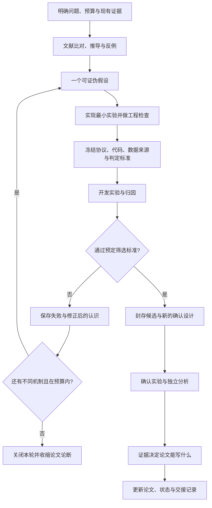

# LearningCost 项目的 Auto Research 拆解与 ALCC 迁移方案

分析日期：2026-09-30。依据用户提供的 `ICLR27-LearningCost-main.zip`，以及本项目此前的稿件、审稿意见和理论重构评估。

本次为静态源码与记录审计：未运行压缩包中的训练、安装、下载、推送或自动化任务。文档里的提示词、工作时间、删除指令和历史授权均作为研究对象，不作为本项目的执行指令。关键原文已按 ZIP 字节保存到 [reference_evidence](autoresearch/reference_evidence/INDEX.md)，附来源与 SHA256 清单。

## 1. 结论：值得学习的是研究闭环，不能把它当成现成的自主科研软件

这个项目的 Auto Research 由三个层次组成：

1. **研究决策层**：会话中的研究者／主 agent 阅读文献、提出假设、改代码、解释结果；必要时用独立 agent 或外部模型复核。
2. **实验执行层**：Python 控制器执行已定义的实验，管理冻结、并发、断点、预算、验证集选型和测试集开放。
3. **持续工作层**：外部应用的定时唤醒与仓库里的交接文件，使研究会话在实验完成后接着工作。

上传源码中没有发现一个调用 LLM、自动提出下一轮算法、生成修改并持续调度的通用研究引擎。它更接近“外部研究代理 + 项目专用实验控制器 + 可追溯研究记录”。这不否定其自动化价值，但决定了我们要迁移的是方法与接口，不能指望解压后运行一个命令，就让 ALCC 自动完成理论突破。

证据分别是 [实验控制器](autoresearch/reference_evidence/experiments/threshold_longrun/run.py.txt)、[实际 campaign](autoresearch/reference_evidence/experiments/threshold_longrun/research/CAMPAIGN.md) 和 [会话交接提示词](autoresearch/reference_evidence/reviews/current/NEXT_SESSION_GPT_PRO_REVISION_PROMPT.md)。对根 `scripts/`、`experiments/` 的静态搜索未发现 LLM API／外部 agent 启动调用；该结论不覆盖作者仓库外的工具。

## 2. 各部分分别负责什么

| 部分 | 项目中的具体材料 | 实际职责 | 不能由此推断的能力 |
|---|---|---|---|
| 总入口 | `README.md`、`START_HERE.md` | 当前论文、实验状态与证据入口 | 文件名带 ICLR，不表示已被 ICLR 接收 |
| 深度研究任务书 | `R049_WEB_GPT_PRO_MASTER_PROMPT.md` | 要求从场景、最近理论、反例走到算法和可检验实验 | “至少 12 小时、六团队”是任务要求，不是执行证明 |
| 主 agent 与复核者 | 下一会话 prompt、逐轮 review | 主 agent 集成；其他角色做有边界的查错 | 多份角色文字不必然等于多个独立模型或真正独立实验 |
| 持续唤醒 | `CAMPAIGN.md` 的 heartbeat 记录 | 每 15 分钟继续同一会话，读取状态后决定下一步 | ZIP 不包含可恢复这项外部任务的独立 daemon |
| 实验控制器 | `threshold_longrun/run.py`、`warcraft_matched/run_pipeline.py` | 运行预定矩阵、封存选型、开放评估、保存状态 | 不负责创造新的科学假设 |
| 证据与论断管理 | `*_RESEARCH.md`、`*_RESULTS.md`、`*_REVIEW.md` | 区分观察、解释、候选机制、允许写入论文的结论 | review 文件存在不等于论断已正确 |
| 审稿包 | `package_autoresearch_review.py` | 汇总源码、协议、回执和部分预测，生成清单 | 便携审稿包不等于可从头训练的完整发布包 |

实际协作强度也应分清：`ROUND0_RESEARCH.md` 第 3 行写的是本地研究、没有搜索子 agent；`ROUND0_CLAIM_REVIEW.md` 披露了可用次级模型复核，以及没有亲自重放全部模型快照。因此不能把 master prompt 要求的团队配置当成每一轮实际采用的配置。

## 3. 真正的闭环怎样运行

**第一步：先把“想得到什么”改成“什么结果会推翻它”。**

长训练开始前，项目没有写“BCE 必然更好”，而是将“长训练是否保留 BCE 优势”记为 uncertain。同时先做代数检查，发现一种所谓 Brier 梯度修正会精确恢复 BCE，因此不把它包装成新算法，也不为重发现 BCE 跑完整训练矩阵。见 [ROUND0_RESEARCH](autoresearch/reference_evidence/experiments/threshold_longrun/research/ROUND0_RESEARCH.md)。

**第二步：先定义有解释力的比较，再跑实验。**

长训练固定输出头、初始化、批次流和更新次数，匹配超参数搜索预算；按数据生成单位或数据划分统计，而非把多个相关优化种子当作独立数据。checkpoint 和学习率等由验证集选择。控制器把实验设计、源码、QA 和校准结果绑定到 freeze；选择结果另行封存。见 [run.py](autoresearch/reference_evidence/experiments/threshold_longrun/run.py.txt) 第 10–25、49–72 行。

**第三步：用程序降低“无意改了实验”的概率。**

运行时校验冻结来源；完成矩阵后才允许选型；完整开发和确认回执满足检查后才开放正常测试入口。失败留下 traceback 与失败回执，并暂停。训练保存模型、优化器和随机状态，以便续跑。源项目不同实验的实现有差异，不能把其中一套控制器的特性无差别归给所有旧实验。

Digits 的多个划分均来自同一个 1797 图像池，相关结论条件于这个数据池，不能当作在独立来源数据集上的复制。

这些是程序性约束，不是外部不可篡改预注册，也不是测试集物理隔离。同一工作区内仍可绕过正规接口读数据。哈希能发现字节漂移，不能单独证明研究者事前没有见过结果。见 [core.py](autoresearch/reference_evidence/experiments/threshold_longrun/core.py.txt) 第 18、43–46、64–75 行。

**第四步：结果出来后，先解释失败，再提出下一项有限干预。**

每轮的文献、观察、机制假设、设计、结果、复核分开记录。比如观察到饱和率下降，只能说明这个诊断量变了；若决策误差没有改善，就不能把它写成已证实的性能机制。下一轮不直接继承“会成功”的叙事，而是提出新的待检验假设。

**第五步：复核者决定论断是否越过证据。**

复核会查：基线是否同预算、独立单位数是否正确、统计检验能否达到要求、效果量够不够、局部改善是否被冒充整体改善、有没有把数学性质写成普遍性能优势。它还可以把建议标成 accept / modify / reject / defer，而非服从更大模型的意见。见 [交接任务](autoresearch/reference_evidence/reviews/current/NEXT_SESSION_GPT_PRO_REVISION_PROMPT.md) 第 18–23、68–86 行。

**第六步：通过文件交接，而不是依赖聊天记忆。**

下一会话读取当前状态、冻结实验、论断清单和最近决定；外部评审保留原文后逐项核验。应用 heartbeat 只负责让会话继续有机会工作，不能代替研究判断。源项目最后明确暂停自动跟进，关闭已失败的搜索方向。见 [CAMPAIGN](autoresearch/reference_evidence/experiments/threshold_longrun/research/CAMPAIGN.md) 第 7、40–46 行。

## 4. 一条有据可查的研究演化链

选取 `threshold_longrun` campaign，而非混合所有历史路线：

1. **原问题**：短训练下的损失优势，在更长预算和不同划分上是否保持？
2. **初始检验**：648 次开发训练 + 120 次确认训练，每次至多 6000 步。
3. **意外结果**：BCE 没有达到强优势标准。Brier 在两个合成任务上优于同输出头 Mean-MSE；Digits 比较未通过声明的多重校正。新旧设计还改变了选型、采样等，不能只归因于训练变长。
4. **接连提出有限改动**：学习率日程 → SPO+ → 保持均值的平滑 → EMA → 均值误差混合。
5. **每次都可能失败**：失败的筛选不进入新一轮确认；也不切换为只报告好看的任务。
6. **关闭方向**：总计 1152 条科学优化轨迹后，五项改动全部未过门，预算尚未用完也停止。

| 开发筛选 | 优化轨迹 | 相对本轮匹配对照的平均改善 | 处理 |
|---|---:|---:|---|
| 余弦学习率 | 72 | −0.658 个百分点 | 不进入确认 |
| SPO+ 项 | 108 | −0.564 个百分点 | 不进入确认，regret 也恶化 |
| 保持均值的平滑 | 84 | −0.716 个百分点 | 不进入确认 |
| EMA | 36 | +0.130 个百分点 | 低于事先设定的 0.3 门槛 |
| 均值误差混合 | 84 | +0.119 个百分点 | 改善不足，且一个任务／损失单元恶化 1.758 个百分点 |

表内各轮的种子和聚合范围不同，不能用此表给五种算法做横向排名。EMA 的相关影子模型也不能重复算作独立训练。数值来自项目保存的[结果报告](autoresearch/reference_evidence/experiments/threshold_longrun/research/AUTO_RESEARCH_REPORT_ZH.md)，本次未重跑训练。

其中 SPO 一轮很有代表性：[研究账本](autoresearch/reference_evidence/experiments/threshold_longrun/research/SPO_SCREEN_RESEARCH.md) 明确推翻“regret 改善必然降低错误频率”；保留两种指标；承认 SPO+ 是既有方法；108 次开发拟合失败后，没有用 Digits 的局部改善挽救整体结论。这是自动研究有价值的部分：使错误方向更早、以更有解释力的方式结束。

## 5. 怎样客观评价这个项目

### 值得借鉴

- 研究问题先写成可被否定的假设，理论和实验互相约束。
- 对照匹配到输出接口、解码器、训练预算和选型机会，减少“方法优势”中的混杂。
- 失败实验、失败工程检查、模型替代和复核范围有记录。
- 小规模开发筛选控制成本；新确认不为不达标的候选兜底。
- 理论、实验结论、论文措辞有明确的对应关系。
- 使用状态、协议、回执、交接文件，使跨会话研究可继续。

### 需要避免照搬

- **把流程严谨当成贡献重大。** 项目最终承认没有实现强算法优势；内部评审还质疑新颖性和意义。内部评分及接收概率不是正式同行评审，也不是校准过的预测。
- **任务书无限膨胀。** 六团队、长时间工作、众多 review 文档只有在解决不同问题时才有价值。我们更适合一个主 agent 加最多三个有边界的并行审计任务。
- **技术检查全部通过，却没有研究成功。** 训练、回执、重放无错误，只支持“实验跑对了”；不支持“方法有用”。
- **文档不断追加，当前结论漂移。** `START_HERE.md` 留有多个日期的 “Current”，页面数与论文状态随历史变化。ALCC 应维持单一当前状态入口，旧状态放进日志。
- **把模型意见当成独立实证。** 不同提示词下的审稿意见可能高度相关。应让复核者自行重算、构造反例、查原始文献，并披露没有复现的部分。
- **无界的小系数补救。** 新轮次要对应新机制；连续失败后若只剩换几个系数，就应关闭路线。

## 6. 这份 ZIP 的复现边界

本次直接检查归档字节，得到：

- 实际文件 24,757 个；其中 13,565 个为 Git LFS 指针。
- 指针包括 9,820 个 `.pt`、3,535 个 `.npz`，另有数组、图片、PDF 和嵌套 ZIP。
- 去重后的 10,739 个对象声明约 2.954 GB 实体数据；这些实体不在当前 ZIP 中，也未核实其远端可下载性。
- 抽查发现历史 freeze 的原始字节 SHA 与 ZIP 文本存在差异。多数可由 Windows CRLF 与 Git LF 转换解释；少数文件仍未厘清，不据此指控篡改。
- 当前 CI 只做目录检查、Python 编译和 JSON 解析，未运行 pytest、训练或数学正确性检查。
- 某些旧 runner 无条件导入 Windows 的 `msvcrt`；较新实现才区分 Windows / Unix。历史打包路径也未必适用于当前目录。

因此，能说的是“审查了控制逻辑、协议和保存的证据”，不能说“已经独立复现整个研究”。原报告里的 QA / replay passed 是历史环境下的记录。本次原样复制的清单也只是当前 ZIP 来源标识，**不是替原有 freeze 重新签发有效性证明**。见 [本次清单](autoresearch/reference_evidence/MANIFEST.json)、[QUICKSTART](autoresearch/reference_evidence/QUICKSTART.md) 与 [CI](autoresearch/reference_evidence/.github/workflows/quality.yml)。

预算口径同样需要限定：6720.884 / 14400 秒是这次 campaign 的累计实验占用账本，含失败和重复 QA、校准；分析、写作、模型调用时间另计。不是全项目两小时完成，不是精确 GPU 活跃秒，也不是将四个 worker 的 CPU 核时相加。不能拿它估计你的 MAPPO 项目耗时。

## 7. ALCC 怎样采用同样过程

你的目标已从“尽快补齐现稿”扩大为“用 1–2 个月探索实质重构”。最合适的第一轮是**研究路线筛选**，而非立即让 agent 长时间调 MAPPO。

先把三个层次拆开：

| 层次 | ALCC 要回答的问题 | 最便宜而有辨别力的证据 |
|---|---|---|
| 正确性基础 | 原速率解、优先级定义、容量、代码执行是否一致？ | 小实例手算、枚举／高精度解、实现边界检查 |
| 理论增量 | 旧解误差与参数漂移的证书、按需精化、切换控制，比最近结果多了什么？ | 逐定理对照、独立证明、删除假设后的反例 |
| 算法价值 | 证书开销是否比 warm start / 重验旧 dual gap 更小，同时保持决策质量？ | 无需训练策略的小型动态分配实验，完整计算计账 |

此前的[通用理论评估](general_theory_reconstruction_feasibility_2026-09-29.md) 是候选来源，不能升级成已经确定的新颖性结论。尤其是：标准 KKT／势博弈／容量价格不是新理论；学习建议加证书也已有先例；缓存复用需要证明比直接重新检查更有价值。

**建议第一轮集中于一个问题：**

> 在固定可行域、优先级发生变化时，复用非精确旧解的证书能否减少离散指派比较中的计算，并给出清楚的有效范围？

这一问题的性价比在于：先用精确小实例就能排除证书错误、过度保守和无实际加速，再决定是否值得接入 MAPPO。候选来源可以先用枚举、贪心或固定提案，从而把“执行机制是否有效”与“学习器是否训练好”分开验证。

必须主动寻找的失败情形包括：优先级全部变化、频繁容量变化、价值接近切换阈值、候选指派首次出现、缓存淘汰、执行分配精度导致额外求解，以及多个节点同时提交破坏原保证。若实际总开销没有下降，即使证书定理成立，也应收缩算法贡献。

### 六至八周安排与退出条件

| 时间 | 主要工作 | 决策点 |
|---|---|---|
| 第 1 周 | 最近理论逐条比对；证明／反例；原代码与模型口径审计；最小计算成本试验 | 若只是已有结果的直接推论，或计算优势无希望，转向较小范围修稿 |
| 第 2 周 | 保留一条主线；完成最小算法与精确 oracle；冻结开发设计 | 数学和实现不一致则先修正，不进入大训练 |
| 第 3–4 周 | WSN 开发实验；强 warm-start、dual-check、greedy 等对照；必要时接入学习候选器 | 若优势来自弱基线或漏算开销，不扩大实验 |
| 第 5 周 | 第二个物理含义不同的实例，优先考虑边缘 CPU 分配；压力与失效边界 | 若只在一种应用成立，保留通用模型但缩小经验性声明 |
| 第 6 周 | 封存方法，在未用于选型的场景与种子上做确认；独立复算 | 不因确认失败再利用同一确认结果调参并称独立 |
| 第 7–8 周 | 理论—算法—实验统一写作，审稿式复核，按实际证据确定转投层级 | 依据成果完成投稿版本；不以未取得的“顶会级突破”为完成标准 |

六周窗口可将跨应用试验和写作并行；不应压掉公平对照或确认环节来换“结果好看”。期刊选择到主结果稳定后再核查，因为研究类型和实际证据可能改变适配范围。

### 建议的 agent 分工

主 agent 维护唯一当前状态，决定下一轮问题并集成代码与论文。可并行分派：

- 文献审计：找最接近结果，记录定理、假设、算法差异，不替作者辩护。
- 理论反例：从原始定义重推，特别检查可行域变化、联合动作提交、长期收益与单步收益的区别。
- 实验审计：检查公平预算、环境状态、指标、统计单位、失败回执与实际运行命令。

并行角色提交独立证据，主 agent 阅读原文件后做决定。相同文件由单一负责人修改。研究取舍仍需你和导师掌握；常规检索、查错、分析和已约定范围内的运行可持续推进，无需每个步骤重新确认。

### 需要为 ALCC 专门补的工程

此项目的监督学习 checkpoint 不能直接套在 MAPPO 上。可靠续跑除了模型和优化器，还涉及仿真时钟、节点队列、拓扑／流量随机生成器、父节点状态和 rollout buffer。应该先明确是在 episode 边界可恢复，还是声称任意步精确恢复，再写相应检查。

资源账本至少分开：并行作业占用墙钟、GPU 作业时长、失败／校准成本、模型调用费用。具体设备和总训练预算目前未配置；先做本地短校准，再形成可执行上限，不照抄源项目四小时预算。

## 8. 本次已经落地的最小工作区

已建立 [autoresearch/README.md](autoresearch/README.md)，其中包含：

- `STATE.json`：唯一当前状态，明确没有训练或外部定时任务在运行。
- `RESEARCH_CHARTER.md`：目标、角色、成功／失败含义和预算口径。
- `CLAIM_LEDGER.md`：已知问题、标准结果、候选理论及禁止外推的边界。
- `rounds/R001/PLAN.md`：第一轮路线筛选计划，明确为未冻结草案。
- `templates/ROUND.md`：后续每轮从问题、协议、成本到结果和允许论断的统一模板。
- `prompts/NEXT_SESSION.md`：下一次会话可直接使用的启动文本。
- `DECISIONS.md`：本次搭建决定；不将已有分析伪装成事前注册实验。
- `reference_evidence/`：30 个关键来源文件及本次来源清单；Python 只保存为 `.py.txt` 供阅读。

这是研究工作区与执行约定，不是已经安装的无人值守研究系统。本次没有启动外部 heartbeat，也没有重新训练 ALCC。最有价值的下一步已经具体化为 R001：先决定是否值得把未来数周投入证书复用这一候选主线。
